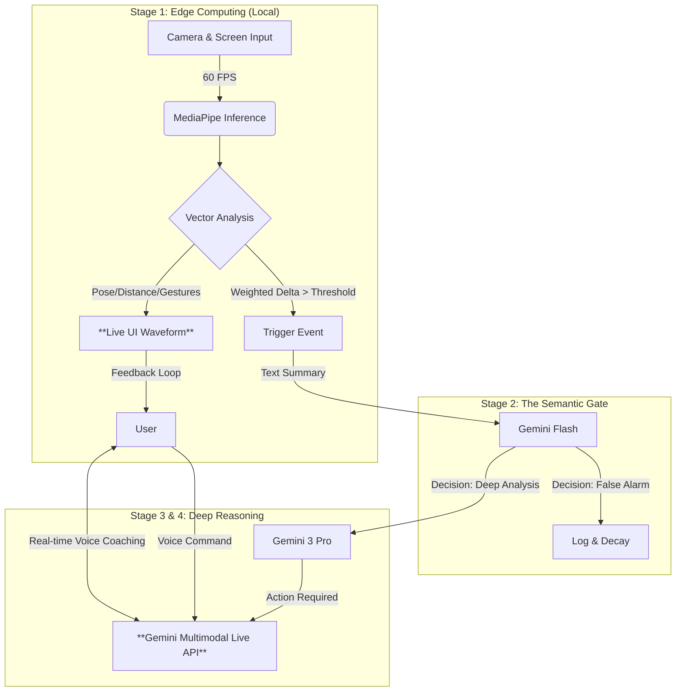

# NeuroSync: The Hybrid-Cognitive Engine 🧠⚡️

[](https://opensource.org/licenses/MIT)
[](https://deepmind.google/technologies/gemini/)
[](https://nodejs.org/)

> **Edge-Speed Sensing. Cloud-Scale Reasoning. The Future of Deep Work.**

**NeuroSync** is a multimodal AI workspace companion designed to maximize human "Flow State". Unlike traditional wrappers, it employs a **tiered hybrid architecture**—combining millisecond-level local vector analysis with Google Gemini 3 Pro's deep reasoning—to detect cognitive load, stress, and distraction in real-time.

---

## 📸 Demo & Visuals


---

## 🏗 System Architecture

NeuroSync solves the **Latency vs. Intelligence** trade-off using a smart **4-Stage Cognitive Pipeline**.



### The 4-Stage Pipeline
1.  **Stage 1: Real-time Edge Sensing (Zero Latency)**
    *   Local MediaPipe inference tracks **11 of 52 facial blendshapes**, head pose (nodding/shaking), and body distance.
    *   These vectors directly drive the **Sine/Cosine Waveform UI** (Frequency, Amplitude, Color) instantly.
2.  **Stage 2: The Semantic Gate (Gemini Flash)**
    *   When the "Vector Change Rate" breaches a threshold, a lightweight request is sent to Gemini Flash to decide if deep analysis is needed.
3.  **Stage 3: Deep Multimodal Reasoning (Gemini 3 Pro)**
    *   For genuine anomalies, Gemini 3 Pro analyzes screen context + user video to diagnose the root cause (e.g., "User is frustrated by a coding error").
4.  **Stage 4: Proactive Voice Interface (Live API)**
    *   The system triggers the **Multimodal Live API** to proactively speak to the user, offering help or coaching.

---

## 🧮 Core Algorithms

We don't just guess; we calculate. NeuroSync uses a **Weighted Vector Displacement (WVD)** algorithm to quantify cognitive behavior changes locally.

### 1. Facial Vector Change Rate
We calculate the Euclidean distance between the current frame's vector and a rolling average, applying specific weights to critical blendshapes (e.g., `browDown_Left`, `eyeWide_Right`, `jawOpen`).

$$ WVD_t = \sum_{i=1}^{n} w_i \cdot \sqrt{(v_{i,t} - \bar{v}_{i, t-1s})^2} $$

*   **Logic:** High frequency changes in `browDown` (frowning) + `posture_Z` (leaning in) often indicate high cognitive load or stress.

### 2. Screen Context Delta
Screen captures are downsampled to **64x64px** for privacy and speed. We compute the **Color Histogram Euclidean Distance** to distinguish between "scrolling documentation" (low delta) and "switching tasks entirely" (high delta).

---

## Core Detections

Using MediaPipe FaceLandmarker for real-time face detection, analyzing 52 facial blendshapes and a 4x4 transformation matrix to determine expressions and posture.

### Detection Pipeline
The entire detection loop runs at approximately 60fps:
1. Get facial features
2. Extracts blendshapes and transformation matrix
3. Calculates change rates for expressions, rotation, and position
4. Triggers corresponding events based on thresholds
5. Updates UI display and anomaly score

### Expression Detection
Expressions are detected by monitoring the rate of change in specific facial blendshapes:
- Monitors 11 key blendshapes including eyebrows, eyes, jaw, and mouth
- Calculates Euclidean distance between current expression and historical average
- Triggers expression event when change rate exceeds (0.2) and position change is minimal

### Posture Detection
Posture is obtained by calculating Euler angles from the facial transformation matrix
- Extracts rotation components from the 4x4 transformation matrix
- Compute pitch, yaw, and roll angles
- Position changes are detected through the matrix's translation components [x,y,z], with z-axis used for forward/backward tilt detection

### Nod/Shake Detection
Nodding and shaking are detected by analyzing angle history buffers:
- Maintains a 15-frame angle buffer
- Nod: pitch angle range exceeds (12°)
- Shake: yaw angle range exceeds (15°)

---

## 🚀 Getting Started

### Prerequisites
*   Node.js (v18 or higher)
*   Google Cloud API Key (with access to Gemini 1.5 Pro / Gemini 2.0 / Multimodal Live)

### Installation

1.  **Clone the repository**
    ```bash
    git clone https://github.com/gaofc/NeuroSync.git
    cd NeuroSync
    ```

2.  **Install dependencies**
    ```bash
    npm install
    ```

3.  **Run the Development Server**
    ```bash
    npm run dev
    ```
    Open your browser and navigate to `http://localhost:3000` (or the port shown in your terminal).

---

## 🌟 Key Features

*   **🌊 Ambient Waveform UI:** A generative visualization based on Sine/Cosine math that reacts to your micro-movements (breathing, posture, distance).
*   **⚡️ Hybrid Inference:** Uses local CPU for 60fps tracking and Cloud TPU for reasoning.
*   **🗣️ Proactive AI Voice:** Powered by Gemini Multimodal Live API, it speaks to you when you need it most.
*   **🎯 Goal-Oriented:** Set a goal ("Finish refactoring"), and the AI acts as a dedicated supervisor for that specific task.
*   **🔋 Efficiency:** "Change Rate" algorithms ensure we only call expensive APIs when absolutely necessary.
*   **🔋 customization:** More than ten parameters, including threshold, weight, sensitivity, etc., can be configured through the settings page.

---

## 🛠 Tech Stack

*   **Frontend:** React, TypeScript, Vite
*   **Computer Vision:** MediaPipe (Face Landmarker, Pose Landmarker), OpenCV.js
*   **AI Models:** Google Gemini 1.5 Flash (Routing), Gemini 1.5 Pro (Vision/Reasoning), Gemini Multimodal Live API (Voice).
*   **Animation:** Framer Motion, HTML5 Canvas API.

---

## 📄 License

Distributed under the MIT License. See `LICENSE` for more information.
